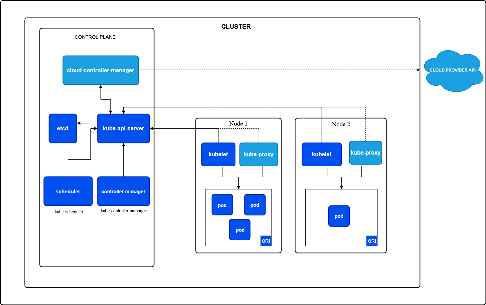

## Introduction to Kubernetes

### Introduction/Summary of Container Technologies (Docker), Basics

TODO

Container vs Image:
- **Image**: A ready to run SW package, which includes the application and its dependencies, but is not running.
- **Container**: A running instance of an image, which includes the application and its dependencies.
  - should be immutable and stateless (as much as possible)

### Why Kubernetes? The Need for Orchestration

TODO

### Kubernetes architecture: master and node components

#### Control plane and Worker nodes

- **Control plane**: manages the Kubernetes cluster, making global decisions about the cluster (e.g., scheduling), detecting and responding to cluster events.
- **Worker nodes**: run the applications and workloads, managed by the control plane.
- A single node acts as both control-plane and worker



#### Control plane components:

- kube-apiserver
  - exposes the Kubernetes API
  - central point of communication for all components
- etcd
  - distributed key-value store for all cluster data
- kube-scheduler
  - watches for newly created pods and assigns them to nodes
- kube-controller-manager
  - runs controller processes that handle routine tasks in the cluster

#### Node components:

- kubelet
  - ensuring that containers are running in a pod according to PodSpec
      - kube-proxy
      - maintains network rules on nodes, allowing communication to pods
      - implements part of the Kubernetes Service concept
- Container runtime (e.g., Docker, containerd)
  - responsible for managing the execution and lifecycle of containers 


### Installation of Kubernetes (e.g. with Minikube or kubeadm). Ideally, a lab environment provided by the training provider.

TODO decide based on lab environment

The best possible way would be to skip this. Minikube is quite easy to install and use. Alternatively it is possible to run kubernetes in Docker Desktop.

### Get started with Kubernetes: pods, deployments, services

#### Pod
Core Concept:

- A Pod is the smallest deployable unit in Kubernetes.
- It contains one or more containers (usually one primary, others are "sidecars").

Pods are ephemeral and disposable: they get new IPs if they restart or are re-scheduled. This is a problem Services will solve.

Shared resources: Containers in a Pod share network namespace and volumes.

Usually, Pods are not created directly, but via. Deployments.

Pod is meant to run a single instance of an application. In case of scaling, multiple Pods are created. (Replication)

```yaml
apiVersion: v1
kind: Pod
metadata:
  name: nginx-pod
spec:
  containers:
    - name: nginx
      image: nginx
```

#### ReplicaSet

A ReplicaSet ensures that a specified number of pod replicas are running at any given time.

A ReplicaSet is a higher-level abstraction that manages Pods, ensuring that the desired number of replicas are running.

f a Pod fails, the ReplicaSet will automatically create a new one to maintain the desired count (this is its self-healing capability).

While a ReplicaSet handles replication and self-healing, it does not provide advanced deployment features like rolling updates or rollbacks. That's why Deployments are built on top of ReplicaSets.

#### Deployment
A Deployment manages a set of Pods to run an application workload, usually one that doesn't maintain state.

A Deployment is a higher-level abstraction that manages Pods and ReplicaSets. Hierarchy: `Deployment > ReplicaSet > Pods`

Describe dessired state (e.g., number of replicas, container images, etc.) and the Deployment controller will ensure that the current state matches the desired state.

```yaml
apiVersion: apps/v1
kind: Deployment
metadata:
  name: nginx-deployment
  labels:
    app: nginx
spec:  # ~ ReplicaSet spec
  replicas: 3
  selector:
    matchLabels:
      app: nginx
  template:  # PodTemplateSpec
    metadata:
      labels:
        app: nginx
    spec:  # Pod spec
      containers:
      - name: nginx
        image: nginx
        ports:
        - containerPort: 80
```

#### Service


#### Network model

- every pod gets its own cluster-wide IP address
- pod (cluster) network handles communication between pods
- the service API provides a stable long-lived IP address and hostname for a service implemented in the pod
  - k8s manages EndpointSlice objects to provide  
- Gateways and Ingresses provide external access to services
- Network policies can be used to control traffic between pods and between pods and external world


### Hands-on labs: Creating and managing pods and deployments


---
### Kubectl

Kubectl is the command-line tool for interacting with Kubernetes clusters.

First make sure that you have correct configuration to connect to your cluster (usually in `~/.kube/config`).

```bash
kubectl config get-contexts
CURRENT   NAME             CLUSTER          AUTHINFO         NAMESPACE
*         docker-desktop   docker-desktop   docker-desktop   
          p04              p04              p04
          t04              t04              t04
          
kubectl config use-context <context-name>
```

```bash
kubectl [command] [TYPE] [NAME] [flags]
```

```bash
kubectl get nodes
kubectl get namespaces
```

```txt
NAME                 STATUS   AGE
default              Active   4d17h
kube-node-lease      Active   4d17h
kube-public          Active   4d17h
kube-system          Active   4d17h
local-path-storage   Active   4d17h
```

```bash
kubectl explain node

kubectl explain namespace

kubectl explain pod
kubectl explain pod.spec
```

---

# Hands-on labs: Creating and managing pods and deployments


## Pods

Simple examples of a Pod: [nginx_pod.yaml](./examples/nginx_pod.yaml) and [redis_pod.yaml](./examples/redis_pod.yaml)

```bash
kubectl apply -f examples/nginx_pod.yaml 
kubectl apply -f examples/redis_pod.yaml
```

```bash
kubectl get pods
kubectl get po
```
```bash
kubectl get pods -o wide
```
```bash
kubectl get pod/nginx
```
```bash
kubectl get -f examples/nginx_pod.yaml 
```

### Accessing the pod

```bash
kubectl proxy
```
See: http://localhost:8001/api/v1/namespaces/default/pods/nginx-pod/proxy/

```bash
kubectl port-forward pod/nginx 8000:80
```
See: http://127.0.0.1:8000

```bash
kubectl port-forward pod/redis 6379:6379
```

```bash
redis-cli ping
```

### `describe` - inspect a pod

```bash
kubectl describe pod nginx
kubectl describe pod redis
```

### `exec` - connect (ssh) to a pod

```bash
kubectl exec -it nginx -- /bin/bash
kubectl exec -it redis -- redis-cli  # ping
```

### `logs` - inspect logs of a pod

```bash
kubectl logs nginx
kubectl logs pod/nginx
kubectl logs nginx -f  # --follow=false
```

### `delete` - delete a pod

```bash
kubectl delete pod redis  # or -f examples/redis_pod.yaml
```

## ReplicaSet

Simple example of a ReplicaSet: [nginx_replicaset.yaml](./examples/nginx_replicaset.yaml)

```bash
kubectl apply -f examples/nginx_replicaset.yaml
```

```bash
kubectl get replicaset
kubectl get rs
```

Combined output of get for ReplicaSet and Pods:

```bash
kubectl get rs,po
```

```text
NAME    DESIRED   CURRENT   READY   AGE
nginx   3         3         3       1m

NAME              READY   STATUS             RESTARTS   AGE
pod/nginx         1/1     Running            0          17m
pod/nginx-nzvtj   1/1     Running            0          17m
pod/nginx-c6dc9   1/1     Running            0          17m
pod/nginx-gr7tb   1/1     Running            0          17m
```

### Replication in action

#### Maintaining desired state

Try deleting one of the pods and see how ReplicaSet creates a new one to maintain the desired state.

```bash
kubectl delete pod <pod_name>  # in this example nginx-nzvtj
```

To observe the ReplicaSet in action, you can run:

```bash
kubectl get replicaset -w  # -w for watch, also works for pods and other resources
```

Then in other terminal delete one of the pods and see the output.

```text
NAME    DESIRED   CURRENT   READY   AGE
nginx   3         3         3       13m  # original (desired) state
nginx   3         2         2       13m  # after deleting one pod
nginx   3         3         2       13m  # after ReplicaSet creates a new pod
nginx   3         3         3       13m  # back to desired state (pod comes to ready state
```

```text
NAME              READY   STATUS             RESTARTS   AGE
pod/nginx         1/1     Running            0          17m
pod/nginx-b7ztp   1/1     Running            0          3m27s  # replacement for deleted pod
pod/nginx-c6dc9   1/1     Running            0          17m
pod/nginx-gr7tb   1/1     Running            0          17m
```

#### Updating desired state

Update the ReplicaSet to change the number of replicas:

```yaml
...
spec:
  replicas: 15  # from 3 to 15
...
```

```bash
kubectl apply -f examples/nginx_replicaset.yaml
```

Showing progress of the update:

```text
NAME    DESIRED   CURRENT   READY   AGE
nginx   3         3         3       32m  # initial state
nginx   15        3         3       32m  # after updating desired state
nginx   15        3         3       32m
nginx   15        15        3       32m  # after ReplicaSet creates new pods
nginx   15        15        4       32m  # first pod ready
nginx   15        15        5       32m
nginx   15        15        6       32m
nginx   15        15        7       32m
nginx   15        15        8       32m
nginx   15        15        9       32m
nginx   15        15        10      32m
nginx   15        15        11      32m
nginx   15        15        12      32m
nginx   15        15        13      32m
nginx   15        15        14      32m
nginx   15        15        15      32m  # all pods ready
```

Showing resulting pods:

```text
NAME          READY   STATUS    RESTARTS   AGE
nginx         1/1     Running   0          33m
nginx-72vnr   1/1     Running   0          77s
nginx-75tcz   1/1     Running   0          77s
nginx-b7ztp   1/1     Running   0          20m
nginx-c6dc9   1/1     Running   0          33m
nginx-fncrx   1/1     Running   0          77s
nginx-gr7tb   1/1     Running   0          33m
nginx-grksl   1/1     Running   0          77s
nginx-kkr5d   1/1     Running   0          77s
nginx-kt896   1/1     Running   0          77s
nginx-n6dtp   1/1     Running   0          77s
nginx-qfwmm   1/1     Running   0          77s
nginx-rxz8t   1/1     Running   0          77s
nginx-s9dgx   1/1     Running   0          77s
nginx-sgx4j   1/1     Running   0          77s
nginx-zg2xw   1/1     Running   0          77s
```

#### Cleaning up

```bash
kubectl delete replicaset/nginx
```

ReplicaSet controller will delete all pods for the given ReplicaSet.

```text
NAME    READY   STATUS    RESTARTS   AGE
nginx   1/1     Running   0          42m
```

### ReplicaSet - `labels` intermezzo

See: [labels.md](./special_cases/labels.md)

---
## Deployment

Deployment is a higher-level abstraction that manages Pods and ReplicaSets.

Simple example of a Deployment: [nginx_deployment.yaml](./examples/nginx_deployment.yaml)

```bash
kubectl apply -f examples/nginx_deployment.yaml
```

```bash
kubectl get deployments
kubectl get deploy
```

Combined output of get for Deployment, ReplicaSet and Pods:

```bash
kubectl get deploy,rs,po
```

```text
NAME                    READY   UP-TO-DATE   AVAILABLE   AGE
deployment.apps/nginx   3/3     3            3           36s

NAME                              DESIRED   CURRENT   READY   AGE
replicaset.apps/nginx-cb6645bd8   3         3         3       36s

NAME                        READY   STATUS    RESTARTS   AGE
pod/nginx-cb6645bd8-bsldp   1/1     Running   0          36s
pod/nginx-cb6645bd8-mhzdc   1/1     Running   0          36s
pod/nginx-cb6645bd8-zsnl2   1/1     Running   0          36s
```

### Inspecting a rollout

Lets make a change in the Deployment to downgrade the image version of nginx to `1.28.0`, set value in yaml file: `image: nginx:1.28.0`

After that apply the change:

```bash
kubectl apply -f examples/nginx_deployment.yaml
```

You can check the status of the rollout with:
```bash
kubectl rollout status deployment nginx --watch=true 
```

```text
Waiting for deployment "nginx" rollout to finish: 1 out of 3 new replicas have been updated...
Waiting for deployment "nginx" rollout to finish: 1 out of 3 new replicas have been updated...
Waiting for deployment "nginx" rollout to finish: 1 out of 3 new replicas have been updated...
Waiting for deployment "nginx" rollout to finish: 2 out of 3 new replicas have been updated...
Waiting for deployment "nginx" rollout to finish: 2 out of 3 new replicas have been updated...
Waiting for deployment "nginx" rollout to finish: 2 out of 3 new replicas have been updated...
Waiting for deployment "nginx" rollout to finish: 1 old replicas are pending termination...
Waiting for deployment "nginx" rollout to finish: 1 old replicas are pending termination...
deployment "nginx" successfully rolled out
```

```bash
kubectl get deploy,rs,po -o wide # wide to see additional information
```

```text
NAME                    READY   UP-TO-DATE   AVAILABLE   AGE    CONTAINERS   IMAGES         SELECTOR
deployment.apps/nginx   3/3     3            3           6m8s   nginx        nginx:1.28.0   app=nginx-web

NAME                              DESIRED   CURRENT   READY   AGE     CONTAINERS   IMAGES         SELECTOR
replicaset.apps/nginx-6b66bfb4f   3         3         3       4m38s   nginx        nginx:1.28.0   app=nginx-web,pod-template-hash=6b66bfb4f
replicaset.apps/nginx-cb6645bd8   0         0         0       6m8s    nginx        nginx:1.29.0   app=nginx-web,pod-template-hash=cb6645bd8

NAME                        READY   STATUS    RESTARTS   AGE     IP            NODE              NOMINATED NODE   READINESS GATES
pod/nginx-6b66bfb4f-hfk8v   1/1     Running   0          2m21s   10.244.1.25   desktop-worker2   <none>           <none>
pod/nginx-6b66bfb4f-ptch6   1/1     Running   0          4m38s   10.244.2.25   desktop-worker    <none>           <none>
pod/nginx-6b66bfb4f-s96mv   1/1     Running   0          2m37s   10.244.1.24   desktop-worker2   <none>           <none>
```

You can see that the new version of Deployment is running with the new image `nginx:1.28.0`. There is a new ReplicaSet `nginx-6b66bfb4f` which is serving current pods, while the old ReplicaSet `nginx-cb6645bd8` is still present but not serving any Pods.

Historical ReplicaSets are kept to allow rollbacks and to maintain a history of changes. Number of historical ReplicaSets can be controlled by the `revisionHistoryLimit` field in the Deployment spec. By default, it is set to 10.

### Rollback

To rollback to the previous version of the Deployment, you can use the following command:

```bash
kubectl rollout undo deployment nginx && kubectl rollout status deployment nginx --watch=true
```
This will revert the Deployment to the previous version, which in this case is `nginx:1.29.0`.

```text
deployment.apps/nginx rolled back
Waiting for deployment "nginx" rollout to finish: 1 out of 3 new replicas have been updated...
Waiting for deployment "nginx" rollout to finish: 1 out of 3 new replicas have been updated...
Waiting for deployment "nginx" rollout to finish: 1 out of 3 new replicas have been updated...
Waiting for deployment "nginx" rollout to finish: 2 out of 3 new replicas have been updated...
Waiting for deployment "nginx" rollout to finish: 2 out of 3 new replicas have been updated...
Waiting for deployment "nginx" rollout to finish: 2 out of 3 new replicas have been updated...
Waiting for deployment "nginx" rollout to finish: 1 old replicas are pending termination...
Waiting for deployment "nginx" rollout to finish: 1 old replicas are pending termination...
deployment "nginx" successfully rolled out
```

To see the result:

```bash
kubectl get deploy,rs,po -o wide # wide to see additional information
```

```text
NAME                    READY   UP-TO-DATE   AVAILABLE   AGE   CONTAINERS   IMAGES         SELECTOR
deployment.apps/nginx   3/3     3            3           15m   nginx        nginx:1.29.0   app=nginx-web

NAME                              DESIRED   CURRENT   READY   AGE   CONTAINERS   IMAGES         SELECTOR
replicaset.apps/nginx-6b66bfb4f   0         0         0       13m   nginx        nginx:1.28.0   app=nginx-web,pod-template-hash=6b66bfb4f
replicaset.apps/nginx-cb6645bd8   3         3         3       15m   nginx        nginx:1.29.0   app=nginx-web,pod-template-hash=cb6645bd8

NAME                        READY   STATUS    RESTARTS   AGE   IP            NODE              NOMINATED NODE   READINESS GATES
pod/nginx-cb6645bd8-mzwxx   1/1     Running   0          39s   10.244.2.27   desktop-worker    <none>           <none>
pod/nginx-cb6645bd8-xb27f   1/1     Running   0          42s   10.244.2.26   desktop-worker    <none>           <none>
pod/nginx-cb6645bd8-xqv26   1/1     Running   0          41s   10.244.1.26   desktop-worker2   <none>           <none>
```

You can see that the Deployment is back to the previous version `nginx:1.29.0`, and the old ReplicaSet `nginx-6b66bfb4f` is no longer serving any Pods.

### Rollouts - Declarative vs Imperative intermezzo

In last example we used imperative command to rollback the Deployment. However, it is recommended to use declarative approach for managing Kubernetes resources.

So instead of using `kubectl rollout undo`, you can modify the Deployment YAML file to revert the image version back to `nginx:1.29.0` and apply it again with `kubectl apply -f examples/nginx_deployment.yaml`.

NOTE: Deployments are smart and so if you change the image version in the Deployment YAML file to `nginx:1.28.0` and apply it again, it will reuse the existing ReplicaSet `nginx-6b66bfb4f` and update the Pods to the new image version without creating a new ReplicaSet. On the other hand, the history revision will be incremented.

```bash
kubectl rollout history deployment/nginx
```

```text
REVISION  CHANGE-CAUSE
4         <none>
5         <none>
```
