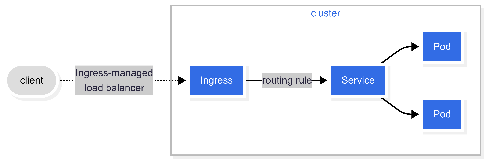

# Introduction to Kubernetes

## Introduction/Summary of Container Technologies (Docker), Basics

TODO

Container vs Image:
- **Image**: A ready to run SW package, which includes the application and its dependencies, but is not running.
- **Container**: A running instance of an image, which includes the application and its dependencies.
  - should be immutable and stateless (as much as possible)

## Why Kubernetes? The Need for Orchestration

TODO

## Kubernetes architecture: master and node components

### Control plane and Worker nodes

- **Control plane**: manages the Kubernetes cluster, making global decisions about the cluster (e.g., scheduling), detecting and responding to cluster events.
- **Worker nodes**: run the applications and workloads, managed by the control plane.
- A single node acts as both control-plane and worker


### Control plane components:

- kube-apiserver
  - exposes the Kubernetes API
  - central point of communication for all components
- etcd
  - distributed key-value store for all cluster data
- kube-scheduler
  - watches for newly created pods and assigns them to nodes
- kube-controller-manager
  - runs controller processes that handle routine tasks in the cluster

### Node components:

- kubelet
  - ensuring that containers are running in a pod according to PodSpec
      - kube-proxy
      - maintains network rules on nodes, allowing communication to pods
      - implements part of the Kubernetes Service concept
- Container runtime (e.g., Docker, containerd)
  - responsible for managing the execution and lifecycle of containers 


## Installation of Kubernetes (e.g. with Minikube or kubeadm). Ideally, a lab environment provided by the training provider.

TODO decide based on lab environment

The best possible way would be to skip this. Minikube is quite easy to install and use. Alternatively it is possible to run kubernetes in Docker Desktop.

## Get started with Kubernetes: pods, deployments, services

### Pod
Core Concept:

- A Pod is the smallest deployable unit in Kubernetes.
- It contains one or more containers (usually one primary, others are "sidecars").

Pods are ephemeral and disposable: they get new IPs if they restart or are re-scheduled. This is a problem Services will solve.

Shared resources: Containers in a Pod share network namespace and volumes.

Usually, Pods are not created directly, but via. Deployments.

Pod is meant to run a single instance of an application. In case of scaling, multiple Pods are created. (Replication)

```yaml
apiVersion: v1
kind: Pod
metadata:
  name: nginx-pod
spec:
  containers:
    - name: nginx
      image: nginx
```

### ReplicaSet

A ReplicaSet ensures that a specified number of pod replicas are running at any given time.

A ReplicaSet is a higher-level abstraction that manages Pods, ensuring that the desired number of replicas are running.

f a Pod fails, the ReplicaSet will automatically create a new one to maintain the desired count (this is its self-healing capability).

While a ReplicaSet handles replication and self-healing, it does not provide advanced deployment features like rolling updates or rollbacks. That's why Deployments are built on top of ReplicaSets.

### Deployment
A Deployment manages a set of Pods to run an application workload, usually one that doesn't maintain state.

A Deployment is a higher-level abstraction that manages Pods and ReplicaSets. Hierarchy: `Deployment > ReplicaSet > Pods`

Describe dessired state (e.g., number of replicas, container images, etc.) and the Deployment controller will ensure that the current state matches the desired state.

```yaml
apiVersion: apps/v1
kind: Deployment
metadata:
  name: nginx-deployment
  labels:
    app: nginx-web
spec:  # ~ ReplicaSet spec
  replicas: 3
  selector:
    matchLabels:
      app: nginx-web
  template:  # PodTemplateSpec
    metadata:
      labels:
        app: nginx-web
    spec:  # Pod spec
      containers:
      - name: nginx
        image: nginx
        ports:
        - containerPort: 80
```

### Service

Exposes an application behind a single outward-facing endpoint, even when the workload is split across multiple backends.

A Service provides a stable IP address and DNS name for a set of Pods, allowing them to be accessed consistently. A Service uses labels and selectors to select which Pods it will route traffic to.

A Service can load balance traffic to multiple Pods, ensuring that the application is highly available and scalable.

If you use a Deployment to run your app, that Deployment can create and destroy Pods dynamically. Because of that you
don't know the IP addresses of the Pods in advance. A Service provides a stable endpoint to access those Pods.

Imagine situation where you have two sets of pods representing backend and frontend of your application. As pods are ephemeral,
you need a way to access the backend pods from the frontend pods without knowing and managing their IP addresses. For that you can use a Service. which will serve as a single point of access to the backend pods.

Service Types (How you expose your application):
- ClusterIP: The default. Exposes the Service on an internal IP address. Only accessible from within the cluster.
  - headless service if `.spec.clusterIP: "None"` 
- NodePort: Exposes the Service on a static port on each Node's IP. Accessible from outside the cluster.
- LoadBalancer: Exposes the Service externally using a cloud provider's load balancer.
- ExternalName: Maps the Service to a DNS name, allowing you to access an external service by name.

```yaml
apiVersion: v1
kind: Service
metadata:
  name: nginx-clusterip-service # Name of your Service
  labels:
    app: nginx-web # Label for the Service itself
spec:
  selector:
    app: nginx-web # CRITICAL: This matches the 'app: nginx-web' label on your Pods
  ports:
    - protocol: TCP
      port: 80 # The port this Service itself will listen on
      targetPort: 80 # The port your container (Nginx) is listening on inside the Pod
  type: ClusterIP # Explicitly setting ClusterIP, though it's the default
```

#### Network model

- every pod gets its own cluster-wide IP address
- pod (cluster) network handles communication between pods
- the service API provides a stable long-lived IP address and hostname for a service implemented in the pod
  - k8s manages EndpointSlice objects to provide  
- Gateways and Ingresses provide external access to services
- Network policies can be used to control traffic between pods and between pods and external world

### Ingress

An API object that manages external access to the services in a cluster, typically HTTP.

An Ingress allows you to define rules for routing external HTTP/S traffic to specific services based on the request's host and path.

In the image there is an example of Ingress that routes traffic to one Service.



Additionally, ingress can be configured to give Services externally-reachable URLs, provide SSL termination, load balancing, and other features.

```yaml
apiVersion: networking.k8s.io/v1
kind: Ingress
metadata:
  name: nginx-ingress
  annotations:
    nginx.ingress.kubernetes.io/rewrite-target: / # Rewrites the request path to '/'
spec:
  ingressClassName: nginx # Important: Specifies which Ingress Controller handles this Ingress
  rules:
  - http:
      paths:
      - path: / # Route traffic for the root path
        pathType: Prefix # Matches any path starting with '/'
        backend:
          service:
            name: nginx-clusterip-service # The name of your ClusterIP Service
            port:
              number: 80 # The port of that Service
    host: nginx.example.com # The hostname you'll use to access the service
```

#### Ingress Controller

In order to make Ingress work, you need to have an Ingress Controller running in your cluster. The Ingress Controller is responsible for fulfilling the Ingress rules and routing the traffic to the appropriate Services.

Ingress Controllers are not part of the Kubernetes core, but are implemented as separate components. Ingress Controllers can be implemented using various technologies, such as NGINX, Traefik, HAProxy, or cloud provider-specific solutions.

Kubernetes as a project supports and maintains AWS, GCE, and [nginx](https://github.com/kubernetes/ingress-nginx) ingress controllers.

[ingress-nginx](https://github.com/kubernetes/ingress-nginx) project is being [discontinued](https://github.com/kubernetes/ingress-nginx/issues/13002) in favor of [ingate](https://github.com/kubernetes-sigs/ingate) project.


#### Gateway API

It is designed to be a more flexible and extensible successor to the original `Ingress API`, providing advanced traffic management, better CRD extensibility, and improved support for modern networking use cases.
`Gateway API` is still evolving and is not yet as widely adopted as `Ingress`, but it is intended to become the standard for service networking in Kubernetes.

The `ingress-nginx` controller uses the original `Ingress API`, while `ingate` is designed to support the newer `Gateway API` in Kubernetes.

---

TODO probably separate hands-ons from theory

## Hands-on labs: Creating and managing pods and deployments

---

## Kubectl

Kubectl is the command-line tool for interacting with Kubernetes clusters.

First make sure that you have correct configuration to connect to your cluster (usually in `~/.kube/config`).

```bash
kubectl config get-contexts
CURRENT   NAME             CLUSTER          AUTHINFO         NAMESPACE
*         docker-desktop   docker-desktop   docker-desktop   
          p04              p04              p04
          t04              t04              t04
          
kubectl config use-context <context-name>
```

```bash
kubectl [command] [TYPE] [NAME] [flags]
```

```bash
kubectl get nodes
kubectl get namespaces
```

```txt
NAME                 STATUS   AGE
default              Active   4d17h
kube-node-lease      Active   4d17h
kube-public          Active   4d17h
kube-system          Active   4d17h
local-path-storage   Active   4d17h
```

```bash
kubectl explain node

kubectl explain namespace

kubectl explain pod
kubectl explain pod.spec
```

---

# Hands-on labs: Creating and managing pods and deployments

## General rules 

### Names

Kubernetes **names** must only contain lowercase alphanumeric characters and -.
For example, the names 123-abc and web are valid, but 123_abc and -web are not.

# Pods

Simple examples of a Pod: [nginx_pod.yaml](./examples/nginx_pod.yaml) and [redis_pod.yaml](./examples/redis_pod.yaml)

```bash
kubectl apply -f examples/nginx_pod.yaml 
kubectl apply -f examples/redis_pod.yaml
```

```bash
kubectl get pods
kubectl get po
```
```bash
kubectl get pods -o wide
```
```bash
kubectl get pod/nginx
```
```bash
kubectl get -f examples/nginx_pod.yaml 
```

## Accessing the pod

```bash
kubectl proxy
```
See: http://localhost:8001/api/v1/namespaces/default/pods/nginx/proxy/

```bash
kubectl port-forward pod/nginx 8000:80
```
See: http://127.0.0.1:8000

```bash
kubectl port-forward pod/redis 6379:6379
```

```bash
redis-cli ping
```

## `describe` - inspect a pod

```bash
kubectl describe pod nginx
kubectl describe pod redis
```

## `exec` - connect (ssh) to a pod

```bash
kubectl exec -it nginx -- /bin/bash
kubectl exec -it redis -- redis-cli  # ping
```

## `logs` - inspect logs of a pod

```bash
kubectl logs nginx
kubectl logs pod/nginx
kubectl logs nginx -f  # --follow=false
```

## `delete` - delete a pod

```bash
kubectl delete pod redis  # or -f examples/redis_pod.yaml
```

---

# ReplicaSet

Simple example of a ReplicaSet: [nginx_replicaset.yaml](./examples/nginx_replicaset.yaml)

```bash
kubectl apply -f examples/nginx_replicaset.yaml
```

```bash
kubectl get replicaset
kubectl get rs
```

Combined output of get for ReplicaSet and Pods:

```bash
kubectl get rs,po
```

```text
NAME    DESIRED   CURRENT   READY   AGE
nginx   3         3         3       1m

NAME              READY   STATUS             RESTARTS   AGE
pod/nginx         1/1     Running            0          17m
pod/nginx-nzvtj   1/1     Running            0          17m
pod/nginx-c6dc9   1/1     Running            0          17m
pod/nginx-gr7tb   1/1     Running            0          17m
```

## Replication in action

### Maintaining desired state

Try deleting one of the pods and see how ReplicaSet creates a new one to maintain the desired state.

```bash
kubectl delete pod <pod_name>  # in this example nginx-nzvtj
```

To observe the ReplicaSet in action, you can run:

```bash
kubectl get replicaset -w  # -w for watch, also works for pods and other resources
```

Then in other terminal delete one of the pods and see the output.

```text
NAME    DESIRED   CURRENT   READY   AGE
nginx   3         3         3       13m  # original (desired) state
nginx   3         2         2       13m  # after deleting one pod
nginx   3         3         2       13m  # after ReplicaSet creates a new pod
nginx   3         3         3       13m  # back to desired state (pod comes to ready state
```

```text
NAME              READY   STATUS             RESTARTS   AGE
pod/nginx         1/1     Running            0          17m
pod/nginx-b7ztp   1/1     Running            0          3m27s  # replacement for deleted pod
pod/nginx-c6dc9   1/1     Running            0          17m
pod/nginx-gr7tb   1/1     Running            0          17m
```

### Updating desired state

Update the ReplicaSet to change the number of replicas:

```yaml
...
spec:
  replicas: 15  # from 3 to 15
...
```

```bash
kubectl apply -f examples/nginx_replicaset.yaml
```

Showing progress of the update:

```text
NAME    DESIRED   CURRENT   READY   AGE
nginx   3         3         3       32m  # initial state
nginx   15        3         3       32m  # after updating desired state
nginx   15        3         3       32m
nginx   15        15        3       32m  # after ReplicaSet creates new pods
nginx   15        15        4       32m  # first pod ready
nginx   15        15        5       32m
nginx   15        15        6       32m
nginx   15        15        7       32m
nginx   15        15        8       32m
nginx   15        15        9       32m
nginx   15        15        10      32m
nginx   15        15        11      32m
nginx   15        15        12      32m
nginx   15        15        13      32m
nginx   15        15        14      32m
nginx   15        15        15      32m  # all pods ready
```

Showing resulting pods:

```text
NAME          READY   STATUS    RESTARTS   AGE
nginx         1/1     Running   0          33m
nginx-72vnr   1/1     Running   0          77s
nginx-75tcz   1/1     Running   0          77s
nginx-b7ztp   1/1     Running   0          20m
nginx-c6dc9   1/1     Running   0          33m
nginx-fncrx   1/1     Running   0          77s
nginx-gr7tb   1/1     Running   0          33m
nginx-grksl   1/1     Running   0          77s
nginx-kkr5d   1/1     Running   0          77s
nginx-kt896   1/1     Running   0          77s
nginx-n6dtp   1/1     Running   0          77s
nginx-qfwmm   1/1     Running   0          77s
nginx-rxz8t   1/1     Running   0          77s
nginx-s9dgx   1/1     Running   0          77s
nginx-sgx4j   1/1     Running   0          77s
nginx-zg2xw   1/1     Running   0          77s
```

### Cleaning up

```bash
kubectl delete replicaset/nginx
```

ReplicaSet controller will delete all pods for the given ReplicaSet.

```text
NAME    READY   STATUS    RESTARTS   AGE
nginx   1/1     Running   0          42m
```

## ReplicaSet - `labels` intermezzo

See: [labels.md](./special_cases/labels.md)

---

# Deployment

Deployment is a higher-level abstraction that manages Pods and ReplicaSets.

Simple example of a Deployment: [nginx_deployment.yaml](./examples/nginx_deployment.yaml)

```bash
kubectl apply -f examples/nginx_deployment.yaml
```

```bash
kubectl get deployments
kubectl get deploy
```

Combined output of get for Deployment, ReplicaSet and Pods:

```bash
kubectl get deploy,rs,po
```

```text
NAME                    READY   UP-TO-DATE   AVAILABLE   AGE
deployment.apps/nginx   3/3     3            3           36s

NAME                              DESIRED   CURRENT   READY   AGE
replicaset.apps/nginx-cb6645bd8   3         3         3       36s

NAME                        READY   STATUS    RESTARTS   AGE
pod/nginx-cb6645bd8-bsldp   1/1     Running   0          36s
pod/nginx-cb6645bd8-mhzdc   1/1     Running   0          36s
pod/nginx-cb6645bd8-zsnl2   1/1     Running   0          36s
```

## Inspecting a rollout

Lets make a change in the Deployment to downgrade the image version of nginx to `1.28.0`, set value in yaml file: `image: nginx:1.28.0`

After that apply the change:

```bash
kubectl apply -f examples/nginx_deployment.yaml
```

You can check the status of the rollout with:
```bash
kubectl rollout status deployment nginx --watch=true 
```

```text
Waiting for deployment "nginx" rollout to finish: 1 out of 3 new replicas have been updated...
Waiting for deployment "nginx" rollout to finish: 1 out of 3 new replicas have been updated...
Waiting for deployment "nginx" rollout to finish: 1 out of 3 new replicas have been updated...
Waiting for deployment "nginx" rollout to finish: 2 out of 3 new replicas have been updated...
Waiting for deployment "nginx" rollout to finish: 2 out of 3 new replicas have been updated...
Waiting for deployment "nginx" rollout to finish: 2 out of 3 new replicas have been updated...
Waiting for deployment "nginx" rollout to finish: 1 old replicas are pending termination...
Waiting for deployment "nginx" rollout to finish: 1 old replicas are pending termination...
deployment "nginx" successfully rolled out
```

```bash
kubectl get deploy,rs,po -o wide # wide to see additional information
```

```text
NAME                    READY   UP-TO-DATE   AVAILABLE   AGE    CONTAINERS   IMAGES         SELECTOR
deployment.apps/nginx   3/3     3            3           6m8s   nginx        nginx:1.28.0   app=nginx-web

NAME                              DESIRED   CURRENT   READY   AGE     CONTAINERS   IMAGES         SELECTOR
replicaset.apps/nginx-6b66bfb4f   3         3         3       4m38s   nginx        nginx:1.28.0   app=nginx-web,pod-template-hash=6b66bfb4f
replicaset.apps/nginx-cb6645bd8   0         0         0       6m8s    nginx        nginx:1.29.0   app=nginx-web,pod-template-hash=cb6645bd8

NAME                        READY   STATUS    RESTARTS   AGE     IP            NODE              NOMINATED NODE   READINESS GATES
pod/nginx-6b66bfb4f-hfk8v   1/1     Running   0          2m21s   10.244.1.25   desktop-worker2   <none>           <none>
pod/nginx-6b66bfb4f-ptch6   1/1     Running   0          4m38s   10.244.2.25   desktop-worker    <none>           <none>
pod/nginx-6b66bfb4f-s96mv   1/1     Running   0          2m37s   10.244.1.24   desktop-worker2   <none>           <none>
```

You can see that the new version of Deployment is running with the new image `nginx:1.28.0`. There is a new ReplicaSet `nginx-6b66bfb4f` which is serving current pods, while the old ReplicaSet `nginx-cb6645bd8` is still present but not serving any Pods.

Historical ReplicaSets are kept to allow rollbacks and to maintain a history of changes. Number of historical ReplicaSets can be controlled by the `revisionHistoryLimit` field in the Deployment spec. By default, it is set to 10.

## Rollback

To rollback to the previous version of the Deployment, you can use the following command:

```bash
kubectl rollout undo deployment nginx && kubectl rollout status deployment nginx --watch=true
```
This will revert the Deployment to the previous version, which in this case is `nginx:1.29.0`.

```text
deployment.apps/nginx rolled back
Waiting for deployment "nginx" rollout to finish: 1 out of 3 new replicas have been updated...
Waiting for deployment "nginx" rollout to finish: 1 out of 3 new replicas have been updated...
Waiting for deployment "nginx" rollout to finish: 1 out of 3 new replicas have been updated...
Waiting for deployment "nginx" rollout to finish: 2 out of 3 new replicas have been updated...
Waiting for deployment "nginx" rollout to finish: 2 out of 3 new replicas have been updated...
Waiting for deployment "nginx" rollout to finish: 2 out of 3 new replicas have been updated...
Waiting for deployment "nginx" rollout to finish: 1 old replicas are pending termination...
Waiting for deployment "nginx" rollout to finish: 1 old replicas are pending termination...
deployment "nginx" successfully rolled out
```

To see the result:

```bash
kubectl get deploy,rs,po -o wide # wide to see additional information
```

```text
NAME                    READY   UP-TO-DATE   AVAILABLE   AGE   CONTAINERS   IMAGES         SELECTOR
deployment.apps/nginx   3/3     3            3           15m   nginx        nginx:1.29.0   app=nginx-web

NAME                              DESIRED   CURRENT   READY   AGE   CONTAINERS   IMAGES         SELECTOR
replicaset.apps/nginx-6b66bfb4f   0         0         0       13m   nginx        nginx:1.28.0   app=nginx-web,pod-template-hash=6b66bfb4f
replicaset.apps/nginx-cb6645bd8   3         3         3       15m   nginx        nginx:1.29.0   app=nginx-web,pod-template-hash=cb6645bd8

NAME                        READY   STATUS    RESTARTS   AGE   IP            NODE              NOMINATED NODE   READINESS GATES
pod/nginx-cb6645bd8-mzwxx   1/1     Running   0          39s   10.244.2.27   desktop-worker    <none>           <none>
pod/nginx-cb6645bd8-xb27f   1/1     Running   0          42s   10.244.2.26   desktop-worker    <none>           <none>
pod/nginx-cb6645bd8-xqv26   1/1     Running   0          41s   10.244.1.26   desktop-worker2   <none>           <none>
```

You can see that the Deployment is back to the previous version `nginx:1.29.0`, and the old ReplicaSet `nginx-6b66bfb4f` is no longer serving any Pods.

## Rollouts - Declarative vs Imperative intermezzo

In last example we used imperative command to rollback the Deployment. However, it is recommended to use declarative approach for managing Kubernetes resources.

So instead of using `kubectl rollout undo`, you can modify the Deployment YAML file to revert the image version back to `nginx:1.29.0` and apply it again with `kubectl apply -f examples/nginx_deployment.yaml`.

NOTE: Deployments are smart and so if you change the image version in the Deployment YAML file to `nginx:1.28.0` and apply it again, it will reuse the existing ReplicaSet `nginx-6b66bfb4f` and update the Pods to the new image version without creating a new ReplicaSet. On the other hand, the history revision will be incremented.

```bash
kubectl rollout history deployment/nginx
```

```text
REVISION  CHANGE-CAUSE
4         <none>
5         <none>
```

---

# Services

Simple example of a Service: [nginx_service_clusterip.yaml](./examples/nginx_service_clusterip.yaml)

```text
kubectl apply -f examples/nginx_service_clusterip.yaml
```

```bash
kubectl get services
kubectl get svc
```

Use `describe` command to inspect details of the service:
```bash
kubectl describe service nginx-clusterip-service
```

The service is of type `ClusterIP`, which means it is only accessible from within the cluster. `ClusterIP` is the default service type.

```text
Name:                     nginx-clusterip-service
Namespace:                default
Labels:                   app=nginx-web
Annotations:              <none>
Selector:                 app=nginx-web
Type:                     ClusterIP
IP Family Policy:         SingleStack
IP Families:              IPv4
IP:                       10.96.62.253
IPs:                      10.96.62.253
Port:                     <unset>  80/TCP
TargetPort:               80/TCP
Endpoints:                10.244.1.2:80,10.244.1.3:80,10.244.2.2:80
Session Affinity:         None
Internal Traffic Policy:  Cluster
Events:                   <none>
```

You can see that the endpoints are the IP addresses of the Pods that are selected by the service.

```text
NAME                        READY   STATUS    RESTARTS        AGE     IP           NODE              NOMINATED NODE   READINESS GATES
pod/nginx-cb6645bd8-9cfx6   1/1     Running   2               2d23h   10.244.1.2   desktop-worker2   <none>           <none>
pod/nginx-cb6645bd8-fqd5q   1/1     Running   2               2d23h   10.244.1.3   desktop-worker2   <none>           <none>
pod/nginx-cb6645bd8-g9gsc   1/1     Running   2 (5h11m ago)   2d23h   10.244.2.2   desktop-worker    <none>           <none>
```

## Accessing the service

To access the service from within the cluster, you can use the service name as a DNS name. For example, if you have a Pod that is running in the same namespace, you can use the following command to access the service:

```bash
kubectl exec -it <pod_name> -- curl http://nginx-clusterip-service
```

or use the proxy:

See: http://127.0.0.1:8001/api/v1/namespaces/default/services/nginx-clusterip-service/proxy/
(dont forget to start `kubectl proxy`)

## Other service types

### NodePort

TODO lets see if it makes sense to use NodePort in the lab environment
TODO See: [nodeport_service.md](./special_cases/nodeport_service)

### ExternalName

See: [externalName_service.md](./special_cases/externalname_service)

### LoadBalancer

TODO lets see if it makes sense to use LoadBalancer in the lab environment

---

# Ingress

Before you can use Ingress, you need to have an Ingress Controller running in your cluster. The Ingress Controller is responsible for fulfilling the Ingress rules and routing the traffic to the appropriate Services.

You can investigate if the Ingress Controller is present by running:

```bash
kubectl get pods -n ingress-nginx  # -n option is for namespace, it can be different in your cluster
kubectl get deployments -n ingress-nginx
kubectl get ingressclass
```

If there is a running Ingress Controller, you should see something like this:

```text
NAME                                        READY   STATUS    RESTARTS   AGE
ingress-nginx-controller-54fc99577f-gwks2   1/1     Running   0          11m

NAME                       READY   UP-TO-DATE   AVAILABLE   AGE
ingress-nginx-controller   1/1     1            1           11m

NAME    CONTROLLER             PARAMETERS   AGE
nginx   k8s.io/ingress-nginx   <none>       11m
```

If you have ingress controller running, you skip the installation section.

## Install ingress-nginx controller

See: [ingress-nginx](https://kubernetes.github.io/ingress-nginx/deploy/) installation instructions

### Installation using Helm:

```bash
helm upgrade --install ingress-nginx ingress-nginx \
  --repo https://kubernetes.github.io/ingress-nginx \
  --namespace ingress-nginx --create-namespace
```

### Installation using kubectl:

```bash
kubectl apply -f https://raw.githubusercontent.com/kubernetes/ingress-nginx/controller-v1.13.0/deploy/static/provider/cloud/deploy.yaml
```

### Other methods

You can also get ingress-nginx controller by installing specific addons (e.g. for minikube or MicroK8s) or they can be provided by your cloud provider.

## Ingress example

Simple example of an Ingress resource: [nginx_ingress.yaml](./examples/nginx_ingress.yaml)

Apply the example Ingress resource to route traffic to the nginx service:

```text
kubectl apply -f examples/nginx_ingress.yaml
```

See the Ingress resource:

```bash
kubectl get ingress
kubectl get ing
```

```text
NAME            CLASS   HOSTS               ADDRESS      PORTS   AGE
nginx-ingress   nginx   nginx.example.com   172.20.0.7   80      5s
```

Use `describe` command to inspect details of the ingress:
```bash
kubectl describe ingress nginx-ingress
```

```text
Name:             nginx-ingress
Labels:           <none>
Namespace:        default
Address:          172.20.0.7
Ingress Class:    nginx
Default backend:  <default>
Rules:
  Host               Path  Backends
  ----               ----  --------
  nginx.example.com
                     /   nginx-clusterip-service:80 (10.244.2.3:80,10.244.2.4:80,10.244.1.4:80)
Annotations:         nginx.ingress.kubernetes.io/rewrite-target: /
Events:
  Type    Reason  Age   From                      Message
  ----    ------  ----  ----                      -------
  Normal  Sync    17s   nginx-ingress-controller  Scheduled for sync
```

Visit: http://localhost/ (localhost works when docker desktop kubernetes is used)

NOTE: try different ingress rules, hostnames, paths, and path types.

## Ingress rules, path types, wildcards and other details

See: [ingress_details.md](./special_cases/ingress_details.md) TODO

---

# Kubernetes resources and application management

This section will transition participants from understanding basic application deployment (Pods, Deployments, Services, Ingress) to managing application configurations, sensitive data, persistent storage, and using higher-level packaging tools for more complex deployments.

## Advanced Resources: ConfigMaps, Secrets, Persistent Volumes

### Volumes

Docs: [kubernetes volumes](https://kubernetes.io/docs/concepts/storage/volumes/)

Kubernetes volumes enable containers within a pod to access and share data through the filesystem. Various volume types serve different needs, including:

- creating configuration files from a ConfigMap or Secret
- offering temporary storage space for a pod
- sharing filesystems between containers in the same pod
- sharing filesystems between pods, even across nodes
- persisting data so it remains available after pod restarts or replacements
- supplying configuration details to applications based on pod metadata (e.g., informing a sidecar of its namespace)
- granting read-only access to data from another container image

From the above mentioned use cases, there are two important requirements that volumes address:
1. **Persistence**: Data should remain available even after the pod is deleted or restarted.
2. **Sharing**: Data should be accessible by multiple containers within the same pod or across different pods.

Thanks to the Kubernetes volume abstraction both requirements can be fulfilled. The Volume abstraction allows you to define a storage resource that can be used by one or more containers in a Pod. Unlike a container's filesystem, which is ephemeral and tied to the lifecycle of the container, a Volume exists independently of any individual container and can persist data across container restarts.

There are different types of Volumes available in Kubernetes, each with its own use case. In this basic course following will be covered:
- `persistentVolumeClaim`: A volume that is backed by a Persistent Volume (PV). It allows you to use persistent storage that can be shared across multiple Pods and survive Pod restarts.
- `configMap`: A volume that contains configuration data from a ConfigMap. It allows you to inject configuration files into the Pod.
- `secret`: A volume that contains sensitive data from a Secret. It allows you to inject sensitive data into the Pod without exposing it in the Pod specification.

Plus some honorary mentions of other types of volumes (TODO move to special cases):
- `emptyDir`: A temporary directory that is created when a Pod is assigned to a Node and exists as long as the Pod is running. It is useful for sharing data between containers in the same Pod.
- `hostPath`: A directory on the Node's filesystem that is mounted into the Pod. It allows you to access files on the Node's filesystem from within the Pod which also make it very dangerous, as it can lead to security issues and data loss if not used carefully.
- `nfs`: A volume that allows you to mount an NFS share into the Pod. It is useful for sharing data between Pods across different Nodes.
- `local`: A volume that allows you to use a local disk on the Node as a storage resource. It is useful for storing data that is specific to a single Node and does not need to be shared across Nodes.

### Persistent Volume Claim (PVC) and Persistent Volume (PV)

`PersistentVolume` (PV) is a piece of storage in the cluster that has been provisioned by an administrator or dynamically provisioned using Storage Classes. It is a resource in the cluster just like a node is a cluster resource.

`PersistentVolumeClaim` (PVC) is a request for storage by a user. It is similar to a Pod in that Pods consume node resources and PVCs consume PV resources. PVCs can request specific size and access modes (e.g., read/write, read-only).

When a PVC is created, Kubernetes will try to find a matching PV that satisfies the request. If a suitable PV is found, it will be bound to the PVC. If no suitable PV is found, the PVC will remain unbound until a matching PV becomes available.

Once the PVC is bound, a Pod can use the PVC as a volume. The Pod simply references the PVC name in its spec, and Kubernetes handles the underlying connection to the storage.

This system effectively separates the concerns of cluster administrators (who provision the storage) from application developers (who just request the storage they need). This is often automated with provisioners like Longhorn or cloud provider-specific solutions like AWS EBS, GCE Persistent Disk, or Azure Disk.

#### Static provisioning vs Dynamic provisioning

For static provisioning, an administrator manually creates a Persistent Volume (PV) resource in the cluster, specifying the storage details such as capacity, access modes, and storage type. This PV can then be claimed by a Persistent Volume Claim (PVC) created by a user or application. See the examples bellow.
```yaml
apiVersion: v1
kind: PersistentVolume
metadata:
  name: example-pv
spec:
  capacity:
    storage: 1Gi
  accessModes:
    - ReadWriteOnce
  persistentVolumeReclaimPolicy: Retain
  hostPath:
    path: /mnt/data
```
```yaml
apiVersion: v1
kind: PersistentVolumeClaim
metadata:
  name: example-pvc
spec:
  accessModes:
    - ReadWriteOnce
  resources:
    requests:
      storage: 1Gi
```

In case of dynamic provisioning, the cluster administrator sets up a StorageClass that defines how storage should be provisioned. When a user creates a PVC that specifies this StorageClass, Kubernetes automatically provisions a new PV that matches the PVC's requirements. This allows users to request storage without needing to know the details of how it is provisioned. The StorageClass can specify parameters like the type of storage (e.g., SSD, HDD), replication settings, and more. For dynamically provisioned PVs you don't create PVs manually.

```yaml
apiVersion: v1
kind: PersistentVolumeClaim
metadata:
  name: longhorn-pvc
spec:
  accessModes:
    - ReadWriteOnce
  resources:
    requests:
      storage: 2Gi
  # StorageClassName is used to specify the StorageClass for dynamic provisioning
  storageClassName: longhorn  # This PVC will use the Longhorn StorageClass for dynamic provisioning
```

In case you want to investigate available StorageClasses in your cluster, you can run:

```bash
kubectl get storageclass
```
#### Binding

See: [binding.md](./special_cases/persistent_volume_binding.md)

#### Persistent Volume Reclaim Policy

- `Retain`: The PV will not be deleted when the PVC is deleted. The PV will remain in the cluster and can be reclaimed with administrator's manual action.
- `Delete`: The PV will be deleted when the PVC is deleted. This is the default behavior for dynamically provisioned PVs.
- `Recycle`: The PV will be scrubbed (data deleted) and made available for reuse when the PVC is deleted. This policy is deprecated and not recommended for use. Dynamic provisioning should be used instead.

#### Storage Object in Use Protection

When a Persistent Volume Claim (PVC) is bound to a Persistent Volume (PV), Kubernetes ensures that the PV cannot be deleted while it is in use by the PVC. This is known as "storage object in use protection." It prevents accidental data loss by ensuring that the storage resource remains available as long as it is actively being used by a Pod.

PVC is in active use by a Pod when a Pod object exists that is using the PVC.

#### PersistentVolume deletion protection finalizer

Finalizers can be added on a PersistentVolume to ensure that PersistentVolumes having Delete reclaim policy are deleted only after the backing storage are deleted.

- `external-provisioner.volume.kubernetes.io/finalizer` to dynamically and statically provisioned CSI (Container Storage Interface) Volumes.

From Kubernetes 1.33, 23rd April, 2025, this is done automatically. 

More on that: https://kubernetes.io/blog/2024/08/16/kubernetes-1-31-prevent-persistentvolume-leaks-when-deleting-out-of-order/]

#### StatefulSet

TODO probably not needed in the basic course, but it is a good idea to mention it here as it is related to Persistent Volumes and PVCs. Separate file maybe

### ConfigMap

A ConfigMap is a Kubernetes resource that allows you to store configuration data in key-value pairs. It is used to decouple configuration from image content, making applications more portable and easier to manage. It should contain **only non-confidential** data (any type of secret **SHOULD NOT** be there).

Pods can consume configuration data from ConfigMaps in several ways:
- environment variables
- command-line arguments
- files in a volume
- through the Kubernetes API (dynamically during runtime)

As the motivation for using ConfigMaps, consider the following example. Imagine there is a web application that needs to connect to a database. Instead of hardcoding the database host in the application code, you can store it in a ConfigMap and reference it in the Pod specification. Thanks to that with simple change in ConfigMap you can change the configuration of the application without rebuilding the image. This mechanism becomes be very useful when developing the app locally and deploying it to different environments (e.g. development, staging, production).

Example of a ConfigMap:

```yaml
apiVersion: v1
kind: ConfigMap
metadata:
  name: example-config
data:
  # property-like keys; each key maps to a simple value
  DATABASE_HOST: "db.example.com"
  other_service_url: "http://other-service.example.com"
  
  # file-like keys; each key maps to a file content
  config.txt: |
    # This is a configuration file
    setting1=value1
    setting2=value2
```

In pod specification, you can reference the ConfigMap in several ways:
- as single environment variables:
  - uses `env` block and references a specific key from the ConfigMap:
  ```yaml
  #spec.containers[].env:
  env:
    - name: DATABASE_HOST
      valueFrom:
        configMapKeyRef:
          name: example-config
          key: DATABASE_HOST
  ```
- as a set of environment variables:
  - uses `envFrom` block and imports all keys from the ConfigMap as environment variables:
  ```yaml
  #spec.containers[].envFrom:
  envFrom:
    - configMapRef:
        name: myconfigmap 
  ```
- as a files with volume mounted into the Pod:
  - uses `volumes` and `volumeMounts` blocks to mount the ConfigMap as a file system volume:

  ```yaml
  #spec.containers[].volumeMounts:
  - name: foo  # Name of the volume to mount
    mountPath: /etc/config  # Path inside the container where the ConfigMap will be mounted
    readOnly: true  # Optional, but recommended to prevent accidental changes
  
  #spec.volumes[]:
  - name: config-volume
    configMap:
      name: example-config  # Name of the ConfigMap to use
      items:  # Optional, to specify which keys to include 
        - key: config.txt
          path: config.txt  # Mounts the 'config.txt' key as a file named 'config.txt'
  ```
  - if items field is ommited, all keys from the ConfigMap will be mounted as files in the specified mountPath, with each key becoming a file named after the key.
  ```yaml
  #spec.containers[].volumeMounts:
  - name: foo
    mountPath: /etc/config
    readOnly: true
  
  #spec.volumes[]:
  - name: foo
    configMap:
      name: example-config
      # ommited items field, so all keys will be mounted as files
  ```

#### Immutable ConfigMaps

It is possible to create an immutable ConfigMap, which means that once it is created, it cannot be changed. This can be useful for ensuring that configuration data does not change unexpectedly.

Benefits of immutable ConfigMaps:
- Prevents accidental changes to configuration data
- Improves performance by allowing Kubernetes to close watches for the immutable ConfigMap

```yaml
apiVersion: v1
kind: ConfigMap
metadata:
  ...
data:
  ...
immutable: true  # Makes the ConfigMap immutable
```

NOTE: ConfigMap are not supposed to store large amounts of data (cannot exceed 1 MiB). If you need to store large configuration files, consider using a Persistent Volume or separate database.

### Secret

Secrets are Kubernetes resources used to store sensitive information, such as passwords, tokens, secret keys, and other confidential data. They are designed to keep sensitive data secure and separate from application code.

Secrets are very similar to ConfigMaps, but they are specifically intended for sensitive data. They can be consumed by Pods in a similar way as ConfigMaps, such as through environment variables or mounted as files in a volume.

By default, Secrets are stored unencrypted in Kubernetes etcd. Because of that anyone who has access to the Kubernetes API can read or modify the Secrets. Kubernetes suggest following best practices to secure Secrets:
- Use encryption at rest to encrypt Secrets in etcd.
- Use RBAC (Role-Based Access Control) to restrict access to Secrets.
- Restrict Secrets to only the Pods that need them.
- Use external Secret store solutions like HashiCorp Vault, AWS Secrets Manager, or Azure Key Vault for managing sensitive data.

Good practices for using Secrets: can be found in the [Kubernetes documentation](https://kubernetes.io/docs/concepts/security/secrets-good-practices/).

#### Types of Secrets

Secrets can have different types, which determine how they are used and what data they can contain. The most common types of Secrets provided as built-ins by Kubernetes are:

| Built-in Type                      | Usage                                 |
|-------------------------------------|---------------------------------------|
| Opaque                             | arbitrary user-defined data           |
| kubernetes.io/service-account-token| ServiceAccount token                  |
| kubernetes.io/dockercfg            | serialized ~/.dockercfg file          |
| kubernetes.io/dockerconfigjson     | serialized ~/.docker/config.json file |
| kubernetes.io/basic-auth           | credentials for basic authentication  |
| kubernetes.io/ssh-auth             | credentials for SSH authentication    |
| kubernetes.io/tls                  | data for a TLS client or server       |
| bootstrap.kubernetes.io/token      | bootstrap token data                  |
From [Kubernetes documentation](https://kubernetes.io/docs/concepts/configuration/secret/#secret-types)

You can also create your own custom Secret types by specifying a `type` field in the Secret manifest. Empty string defaults to `Opaque` type.

#### Opaque Secret

Default type of secrets. 

Try to create a simple Opaque Secret with username and password:
- If created with yaml file, you need to encode the values in base64 format.
  ```yaml
  apiVersion: v1
  kind: Secret
  metadata:
    name: my-secret
  type: Opaque
  data:
    username: bXl1c2Vy   # base64 for 'myuser'
    password: bXlwYXNzd29yZA==   # base64 for 'mypassword'
  ```
- If you are creating it through `kubectl create` you need to add `generic` subcommand to specify that you are creating `Opaque` Secret. In this case base64 encoding is done automatically.
  ```bash
  kubectl create secret generic my-secret \
    --from-literal=username=myuser \
    --from-literal=password=mypassword
  ```
And check the resulting Secret:
```bash
kubectl get secret
```
```text
NAME        TYPE     DATA   AGE
my-secret   Opaque   2      2s
```
Data column show the number of key-value pairs in the Secret.

Describe the created Secret:
```bash
kubectl describe secret/my-secret
```
```text
Name:         my-secret
Namespace:    default
Labels:       <none>
Annotations:  <none>

Type:  Opaque

Data
====
password:  10 bytes
username:  6 bytes
```

TODO at least ServiceAccount, DockerConfig in security section

#### Using Secrets in Pods

Pods can consume Secrets in a similar way as ConfigMaps, such as through environment variables or mounted as files in a volume.

In case of secret not being available, the Pod will not start and kubelet will be attempting to restart the Pod until the Secret becomes available or the Pod is deleted.

To use a Secret in a Pod you can:
- add secret reference in `env` block to set environment variables:
  ```yaml
  apiVersion: v1
  kind: Pod
  metadata:
    name: my-secret-env-pod
  spec:
    containers:
    - name: my-app-container
      image: busybox
      command: ["sh", "-c", "echo 'The secret data is: ' && echo $username"]
      envFrom:
      - secretRef:
          name: my-secret
  ```
- mount the Secret as a volume in the Pod:
  ```yaml
  apiVersion: v1
  kind: Pod
  metadata:
    name: my-secret-volume-pod
  spec:
    containers:
    - name: my-app-container
      image: busybox
      command: ["sh", "-c", "echo 'The secret data is: ' && cat /etc/secret-volume/username"]
      volumeMounts:
      - name: secret-volume
        mountPath: "/etc/secret-volume"
        readOnly: true
    volumes:
    - name: secret-volume
      secret:
        secretName: my-secret
  ```

Investigate logs after creatinh both pods `kubectl logs my-secret-env-pod` and `kubectl logs my-secret-volume-pod`.

#### `imagePullSecrets ` - accessing private container registries

When you need to pull images from a private container registry, you can use `imagePullSecrets` in the Pod specification. This allows Kubernetes to authenticate with the private registry using the credentials stored in a Secret.

See [Kubernetes documentation](https://kubernetes.io/docs/tasks/configure-pod-container/pull-image-private-registry/) for more details.

TODO maybe example

## Kubernetes namespace and resource isolation

Simple example of an Namespace resource: [namespace.yaml](./examples/namespace.yaml)

Namespaces are a core feature of Kubernetes that provide a way to divide a cluster's resources into virtual sub-clusters. Think of them as a way to logically isolate resources within a single physical cluster. They are a fundamental tool for organizing and managing resources for different teams, projects, or applications.

Resources like Pods, Services, and Deployments exist within a namespace (always). When you don't specify a namespace, your resources are created in the default namespace.

To create namespace you can use the following YAML manifest:

```yaml
apiVersion: v1
kind: Namespace
metadata:
  name: my-namespace
```

or directly throught `kubectl` command:
```bash
kubectl create namespace my-namespace
```

Either way, you can check the created namespace with:

```bash
kubectl get namespaces
```

As a result you should see something like this:
```text
NAME                 STATUS   AGE
default              Active   21d
ingress-nginx        Active   9d
kube-node-lease      Active   21d
kube-public          Active   21d
kube-system          Active   21d
my-namespace         Active   4s
```

There are 4 initial namespaces created by Kubernetes:
- `default`: The default namespace for resources that do not have a specific namespace assigned. All of our workloads were deployed here so far
  - avoid using the default namespace, create own
- `kube-system`: Contains resources created by Kubernetes itself, such as the control plane components and add-ons.
- `kube-public`: A namespace that is readable by all users (including unauthenticated users). It is mostly used for public resources.
- `kube-node-lease`: Contains lease objects associated with each node in the cluster. It is used to determine the health of nodes.

Then there is a namespace used by the Ingress controller (refer to ingress section):
- `ingress-nginx`: Namespace used by the Ingress controller, if it is installed.

And finally, you can see our new namespace `my-namespace`

Let's describe it
```bash
kubectl describe namespace my-namespace
```
```text
Name:         my-namespace
Labels:       kubernetes.io/metadata.name=my-namespace
Annotations:  <none>
Status:       Active

No resource quota.

No LimitRange resource.
```

### Namespaces and DNS

Whenever you create a service in Kubernetes, it is automatically assigned a DNS name that can be used to access it. The DNS name is constructed using the service name, namespace name, and the cluster domain.

The DNS entry will be of the form: `<service-name>.<namespace-name>.svc.cluster.local`

Where:
- `<service-name>` is the name of the service
- `<namespace-name>` is the name of the namespace where the service is located
- `svc` is a fixed part of the DNS name that indicates it is a service
- `cluster.local` is the default cluster domain, which can be changed in the cluster configuration

If you want to reach service `my-service` in the `my-namespace` namespace, you can use the following DNS name: `my-service.my-namespace.svc.cluster.local`.

On top of that, if your communication is within the same namespace, you can use just the service name: `my-service`.

### Namespace use cases

Namespaces are useful for organizing resources, isolating environments, and managing access control. Here are some common use cases:
- **Environment Isolation**: You can create separate namespaces for different environments, such as development, staging, and production. This allows you to isolate resources and avoid conflicts between environments.
- **Team Isolation**: You can create namespaces for different teams or projects, allowing them to manage their resources independently. This is especially useful in larger organizations where multiple teams share the same cluster.
- **Resource Quotas**: You can set resource quotas for each namespace to limit the amount of resources (CPU, memory, etc.) that can be used by the resources in that namespace. This helps prevent one team or project from consuming all the cluster resources.
- **Access Control**: You can use Role-Based Access Control (RBAC) to restrict access to resources in a namespace. This allows you to control who can create, read, update, or delete resources in a specific namespace.
- **Network Policies**: You can use network policies to control the traffic between resources in different namespaces. This allows you to enforce security policies and isolate resources from each other.
- **Resource Organization**: You can use namespaces to organize resources logically, making it easier to manage and find resources in a large cluster.

### How to use namespace

When creating a resource using yaml manifest, you can specify the namespace in the metadata section:

```yaml
apiVersion: v1
kind: Pod
metadata:
  name: nginx
  namespace: my-namespace # Specify the namespace here
spec:
  containers:
    - name: nginx
      image: nginx:1.29.0
```
Apply the manifest above and then, try `kubectl get po` and `kubectl get po -n my-namespace`. You will get following outputs respectively:
```text
No resources found in default namespace.
```
```text
NAME    READY   STATUS    RESTARTS   AGE
nginx   1/1     Running   0          56s
```

#### Changing default namespace

If you don't specify namespace in the commands with `-n <namespace>`, it assumes the `default` namespace. To avoid specifying the namespace every time, you can set the current namespace context using:

```bash
kubectl config set-context --current --namespace=my-namespace
```

After this both commands from above will return the same result, as the current namespace is set to `my-namespace`.

But for the rest of the workshop please set the namespace back to `default`:

```bash
kubectl config set-context --current --namespace=default
```

#### Contradictory namespace specification

In general you can set the namespace of the resource which you are creating either in the YAML manifest or by using the `-n` flag with `kubectl` commands. But it won't work if you specify it in both places and it will be different.
```bash
kubectl apply -f examples/<manifest>.yaml -n default  # where `metadata.namespace` is set to `my-namespace`
```
You will get an error like this:
```text
error: the namespace from the provided object "my-namespace" does not match the namespace "default". You must pass '--namespace=my-namespace' to perform this operation.
```

### ResourceQuota and LimitRange intermezzo

See: [ResourceQuota and LimitRange](./examples/resource_quotas_and_limit_ranges.md)

## Application management with Helm (package manager for Kubernetes)

[Helm](https://helm.sh/) is a package manager for Kubernetes that simplifies the deployment and management of applications on Kubernetes clusters. It allows you to define, install, and upgrade complex applications using reusable templates called charts.

You can think about helm as an equivalent of `apt` or `yum` for Kubernetes, where you can install applications from repositories, manage their configurations, and upgrade them easily.

Instead of writing, managing, and applying dozens of YAML files for a single application (e.g., a web app, database, and cache), Helm allows you to define, install, and upgrade that entire application with a single command.

Additionally with the possibility to use templating, you can create reusable charts that can be customized for different environments or configurations.

### Using Helm

https://helm.sh/docs/intro/quickstart/

You can search for available repositories with:
```bash
helm repo list
```
```text
Error: no repositories to show
```

To add a repository, you can use the `helm repo add` command. For example, to add the Bitnami repository, which contains many popular Helm charts, you can run:
```bash
helm repo add bitnami https://charts.bitnami.com/bitnami
```
```text
"bitnami" has been added to your repositories
```
Now the bitnami repo is available in the list
```bash
helm repo list
```
```text
NAME    URL                               
bitnami https://charts.bitnami.com/bitnami
```

It is a good practice to update the repository to get the latest charts:
```bash
helm repo update  
```
```text
Hang tight while we grab the latest from your chart repositories...
...Successfully got an update from the "bitnami" chart repository
Update Complete. ⎈Happy Helming!⎈
```

We can search for available charts in the Bitnami repository:
```bash
helm search repo bitnami
```
```text
NAME                                            CHART VERSION   APP VERSION     DESCRIPTION                                       
bitnami/airflow                                 25.0.0          3.0.4           Apache Airflow is a tool to express and execute...
bitnami/apache                                  11.4.6          2.4.65          Apache HTTP Server is an open-source HTTP serve...
bitnami/apisix                                  5.1.4           3.13.0          Apache APISIX is high-performance, real-time AP...
bitnami/appsmith                                7.0.1           1.84.0          Appsmith is an open source platform for buildin...
bitnami/argo-cd                                 10.0.0          3.0.12          Argo CD is a continuous delivery tool for Kuber...
...
```

To install a Helm chart, you can use the `helm install <release_name> <chart_name>` command. For example, to install the MySQL chart from the Bitnami repository, you can run:
```bash
helm install mysql-chart bitnami/mysql
```
```text
NAME: mysql-chart
LAST DEPLOYED: Tue Aug 12 15:21:42 2025
NAMESPACE: default
STATUS: deployed
REVISION: 1
TEST SUITE: None
NOTES:
CHART NAME: mysql
CHART VERSION: 14.0.2
APP VERSION: 9.4.0
...
```
This command will deploy the MySQL chart with the release name `mysql-chart` in the `default` namespace. Helm will create all the necessary Kubernetes resources, such as Pods, Services, and ConfigMaps, based on the chart templates.

To inspect the deployed resources, you can use the following commands:
```bash
helm list
kubectl get pods
```
```text
NAME            NAMESPACE       REVISION        UPDATED                                         STATUS          CHART           APP VERSION
mysql-chart     default         1               2025-08-12 15:21:42.966993997 +0200 CEST        deployed        mysql-14.0.2    9.4.0
```
```text
NAME            READY   STATUS    RESTARTS   AGE
mysql-chart-0   1/1     Running   0          31s
```

To uninstall the Helm release, you can use the `helm uninstall <release_name>` command. For example, to uninstall the MySQL chart, you can run:
```bash
helm uninstall mysql-chart
```
```text
release "mysql-chart" uninstalled
```

### Creating your own Helm chart

You can create your own Helm chart using the `helm create <chart_name>` command. This will generate a basic chart structure with templates and values files.

Let's create a simple Helm chart for a web application:
```bash
helm create my-first-chart
```
A new directory `my-first-chart` will be created with the following structure:
```text
my-first-chart/
├── charts/
├── templates/
│   ├── _helpers.tpl
│   ├── deployment.yaml
│   ├── hpa.yaml
│   ├── ingress.yaml
│   ├── NOTES.txt
│   ├── service.yaml
│   ├── serviceaccount.yaml
│   └── tests/
│       └── test-connection.yaml
├── Chart.yaml
├── .helmignore
└── values.yaml
```

Let's take a look at the important files in the chart:
- `Chart.yaml`: Contains metadata about the chart, such as name, version, and description.
- `values.yaml`: Contains default values for the chart. These values can be overridden when installing the chart.
  - all the templates in the `templates/` directory are referencing the values from this file.
- `.helmignore`: Specifies files and directories to ignore when packaging the chart. (similar to `.gitignore` and `.dockerignore` files)

Then in the directory `templates/` you can find the templates for the Kubernetes resources that will be created when the chart is installed. Most of the templates are very similar to the yaml manifests we have seen so far, but they use Helm's templating syntax to allow for dynamic values based on the `values.yaml` file.

Partial example of a Deployment template:
```yaml
apiVersion: apps/v1
kind: Deployment
metadata:
  name: {{ include "my-first-chart.fullname" . }}
  labels:
    {{- include "my-first-chart.labels" . | nindent 4 }}
spec:
  {{- if not .Values.autoscaling.enabled }}
  replicas: {{ .Values.replicaCount }}
  {{- end }}
  selector:
    matchLabels:
      {{- include "my-first-chart.selectorLabels" . | nindent 6 }}
  template:
    ...
```

Apart from yaml files, you can also find two other files in the `templates/` directory:
- `_helpers.tpl`: Contains helper templates that can be used in other templates. It is a good place to define reusable functions and variables.
- `NOTES.txt`: Contains notes that will be displayed after the chart is installed. It can be used to provide instructions or information about the deployed application.

### Modifying the chart

Let's try to modify the chart and deploy it. Open the `values.yaml` file and find the following section:
```yaml
image:
  repository: nginx
  # This sets the pull policy for images.
  pullPolicy: IfNotPresent
  # Overrides the image tag whose default is the chart appVersion.
  tag: ""
```

Setup the `tag` field to a specific version of the nginx image, for example `1.29.0` as in previous manifest examples:
```yaml
image:
  repository: nginx
  # This sets the pull policy for images.
  pullPolicy: IfNotPresent
  # Overrides the image tag whose default is the chart appVersion.
  tag: "1.29.0"
```

You can see that the `tag` is used in the `deployment.yaml` template in block `.spec.template.spec.containers`:
```yaml
containers:
  - name: {{ .Chart.Name }}
    image: "{{ .Values.image.repository }}:{{ .Values.image.tag | default .Chart.AppVersion }}"
```

It is good practice to check the templates before installing the chart, to see what will be created. You can do that with the `helm template` command:
```bash
helm template my-first-chart ./my-first-chart/
```

To see our change in action we have to install the chart.
```bash
helm install my-first-chart ./my-first-chart
```
```text
NAME: my-first-chart
LAST DEPLOYED: Wed Aug 13 10:41:49 2025
NAMESPACE: default
STATUS: deployed
REVISION: 1
NOTES:
1. Get the application URL by running these commands:
  export POD_NAME=$(kubectl get pods --namespace default -l "app.kubernetes.io/name=my-first-chart,app.kubernetes.io/instance=my-first-chart" -o jsonpath="{.items[0].metadata.name}")
  export CONTAINER_PORT=$(kubectl get pod --namespace default $POD_NAME -o jsonpath="{.spec.containers[0].ports[0].containerPort}")
  echo "Visit http://127.0.0.1:8080 to use your application"
  kubectl --namespace default port-forward $POD_NAME 8080:$CONTAINER_PORT
```
```bash
kubectl get deploy,rs,po,svc,ingress
```
```text
NAME                             READY   UP-TO-DATE   AVAILABLE   AGE    CONTAINERS       IMAGES         SELECTOR
deployment.apps/my-first-chart   1/1     1            1           101s   my-first-chart   nginx:1.29.0   app.kubernetes.io/instance=my-first-chart,app.kubernetes.io/name=my-first-chart

NAME                                        DESIRED   CURRENT   READY   AGE    CONTAINERS       IMAGES         SELECTOR
replicaset.apps/my-first-chart-85764564fb   1         1         1       101s   my-first-chart   nginx:1.29.0   app.kubernetes.io/instance=my-first-chart,app.kubernetes.io/name=my-first-chart,pod-template-hash=85764564fb

NAME                                  READY   STATUS    RESTARTS   AGE    IP           NODE             NOMINATED NODE   READINESS GATES
pod/my-first-chart-85764564fb-tv5tj   1/1     Running   0          101s   10.244.2.6   desktop-worker   <none>           <none>

NAME                        TYPE           CLUSTER-IP      EXTERNAL-IP   PORT(S)   AGE    SELECTOR
service/kubernetes          ClusterIP      10.96.0.1       <none>        443/TCP   27d    <none>
service/my-first-chart      ClusterIP      10.96.164.229   <none>        80/TCP    101s   app.kubernetes.io/instance=my-first-chart,app.kubernetes.io/name=my-first-chart
```

You can see that the image used in the deployment is now `nginx:1.29.0` as we specified in the `values.yaml` file. In this case the ingress was not deployed because it was not enabled in the `values.yaml` file.

But we can still access out nginx using the port-forwarding command provided in the notes:
```bash
kubectl --namespace <namespace> port-forward pod/<pod_name> 8080:80
```

Now visit http://127.0.0.1:8080. Alternatively you can use kube proxy or other methods to access the service.

### Helm context and namespaces

Helm operates directly in the context of your kubectl configuration. It reads the same kubeconfig file that kubectl uses.

As a result of that also a default namespace is the same as the one used by kubectl. If you want to install a Helm chart in a specific namespace, you can use the `--namespace` (similarly to the kubectl) flag when installing the chart:

```bash
kubectl create namespace dev

helm install my-first-chart ./my-first-chart --namespace dev
```

or you can run the helm install command with additional option `--create-namespace` to create the namespace if it does not exist:

```bash
helm install my-first-chart ./my-first-chart --namespace prod --create-namespace
```

Let's check the deployments in all namespaces:

```bash
kubectl get deploy --all-namespaces
```
```text
NAMESPACE            NAME                       READY   UP-TO-DATE   AVAILABLE   AGE
default              my-first-chart             1/1     1            1           96m
dev                  my-first-chart             1/1     1            1           14s
ingress-nginx        ingress-nginx-controller   1/1     1            1           15d
kube-system          coredns                    2/2     2            2           27d
local-path-storage   local-path-provisioner     1/1     1            1           27d
prod                 my-first-chart             1/1     1            1           11s
```

Additionally, you can set the namespace of different resources through `values.yaml` and it's respective templates. It can be useful when you want to use more of `as a code` approach and have all your resources defined in the chart, but don't forget that the namespace of helm release itself is still defined either through flag `--namespace` or by default context namespace. In theory, it is possible to have releases in different namespaces than resources, but it is not a common practice.

### Helm and value overrides

As we have already seen, Helm charts can be customized using the `values.yaml` file. On top of that, additional value files can be used to override the default value file. You can specify multiple value files using the `-f` or `--values` flag when installing or upgrading a Helm chart or you can override specific values using the `--set` flag.

There is an order of precedence for value overriding in Helm:
1. Chart's `values.yaml` file. It is always used automatically when installing or upgrading a chart.
2. Values files specified with `-f` or `--values` flag (in the order they are specified)
3. Command-line overrides using `--set` flag (these have the highest precedence)

So possible command to install a chart with custom values could look like this:
```bash
helm install my-first-chart ./my-first-chart \
  -f ./my-first-chart/values.dev.yaml \
  -f ./my-first-chart/values.eng.yaml \
  --set image.tag=1.29.0 \
```

In the example of this command helm will first load the default values from `values.yaml`, then override them with values from `values.dev.yaml` and `values.eng.yaml` files, and finally override the `image.tag` value with `1.29.0`.

Overriding of values is a powerful feature of Helm that allows you to customize the behavior of your applications without modifying the chart itself. It is especially useful when deploying the same application in different environments (e.g., development, staging, production) with different configurations.

### Helm and environments

When deploying applications in different environments, it is common to have a different values file for each environment.

In our example, we could introduce two additional values files:
- `values.dev.yaml`: Contains values specific to the development environment. 
  ```yaml
  replicaCount: 2
  ```
- `values.prod.yaml`: Contains values specific to the production environment.
  ```yaml
  replicaCount: 3
  ```

Then you can install the chart in the development environment using:
```bash
helm install my-first-chart ./my-first-chart -f ./my-first-chart/values.dev.yaml --namespace dev #--create-namespace
```

And in the production environment using:

```bash
helm install my-first-chart ./my-first-chart -f ./my-first-chart/values.prod.yaml --namespace dev #--create-namespace
```

After that you can check the pods in each namespace:
```bash
kubectl get po -n dev -o wide
kubectl get po -n prod -o wide
```
```text
NAME                              READY   STATUS    RESTARTS   AGE     IP           NODE              NOMINATED NODE   READINESS GATES
my-first-chart-85764564fb-mmgwz   1/1     Running   0          2m34s   10.244.1.6   desktop-worker2   <none>           <none>
my-first-chart-85764564fb-xfzj2   1/1     Running   0          2m34s   10.244.2.9   desktop-worker    <none>           <none>
```
```text
NAME                              READY   STATUS    RESTARTS   AGE     IP            NODE              NOMINATED NODE   READINESS GATES
my-first-chart-85764564fb-fkr5h   1/1     Running   0          2m25s   10.244.1.8    desktop-worker2   <none>           <none>
my-first-chart-85764564fb-hkp5c   1/1     Running   0          2m25s   10.244.2.10   desktop-worker    <none>           <none>
my-first-chart-85764564fb-hshwh   1/1     Running   0          2m25s   10.244.1.7    desktop-worker2   <none>           <none>
```

### Helm release management - `upgrade`, `rollback` and `history`
Now if we decide to modify the chart by changing a value, for example increasing the number of replicas in the `prod` environment, we can do that by modifying the `values.prod.yaml` file:
```yaml
replicaCount: 5
```

Then we can upgrade the release using the `helm upgrade` command:
```bash
helm upgrade my-first-chart ./my-first-chart -f ./my-first-chart/values.prod.yaml --namespace prod
```
In the output you can see that the revision number got increased:
```text
Release "my-first-chart" has been upgraded. Happy Helming!
NAME: my-first-chart
LAST DEPLOYED: Wed Aug 13 13:30:13 2025
NAMESPACE: prod
STATUS: deployed
REVISION: 2
...
```
And the pods get replicated to match the new number of replicas:
```bash
kubectl get po -n prod -o wide
```

```text
NAME                              READY   STATUS    RESTARTS   AGE     IP            NODE              NOMINATED NODE   READINESS GATES
my-first-chart-85764564fb-fkr5h   1/1     Running   0          6m16s   10.244.1.8    desktop-worker2   <none>           <none>
my-first-chart-85764564fb-hkp5c   1/1     Running   0          6m16s   10.244.2.10   desktop-worker    <none>           <none>
my-first-chart-85764564fb-hshwh   1/1     Running   0          6m16s   10.244.1.7    desktop-worker2   <none>           <none>
my-first-chart-85764564fb-pwprb   1/1     Running   0          3s      10.244.2.11   desktop-worker    <none>           <none>
my-first-chart-85764564fb-x4vkr   1/1     Running   0          3s      10.244.1.9    desktop-worker2   <none>           <none>
```

Alternatively you can use the upgrade command with flag `--install` to install the chart if it is not already installed, or just upgrade it if it is already installed.
```bash
helm upgrade my-first-chart ./my-first-chart -f ./my-first-chart/values.prod.yaml --namespace prod
```

Even though that we haven't changed anything with second upgrade, the revision number will be increased again. The current revision history can be checked with command `helm history <release_name>` where you need to use namespace flag if operating in other than default namespace:

```bash
helm history my-first-chart -n prod
```
```text
REVISION        UPDATED                         STATUS          CHART                   APP VERSION     DESCRIPTION     
1               Wed Aug 13 13:25:29 2025        superseded      my-first-chart-0.1.0    1.16.0          Install complete
2               Wed Aug 13 13:30:13 2025        superseded      my-first-chart-0.1.0    1.16.0          Upgrade complete
3               Wed Aug 13 13:31:42 2025        deployed        my-first-chart-0.1.0    1.16.0          Upgrade complete
```

To rollback to a previous revision, you can use the `helm rollback <release_name> <revision_number>` command. For example, to rollback to revision 1, you can run:

```bash
helm rollback my-first-chart 1 --namespace prod
```

The helm history will be updated accordingly:
```text
REVISION        UPDATED                         STATUS          CHART                   APP VERSION     DESCRIPTION     
1               Wed Aug 13 13:25:29 2025        superseded      my-first-chart-0.1.0    1.16.0          Install complete
2               Wed Aug 13 13:30:13 2025        superseded      my-first-chart-0.1.0    1.16.0          Upgrade complete
3               Wed Aug 13 13:31:42 2025        superseded      my-first-chart-0.1.0    1.16.0          Upgrade complete
4               Wed Aug 13 13:36:20 2025        deployed        my-first-chart-0.1.0    1.16.0          Rollback to 1
```
And pod replicas will be reverted to the previous number:
```text
NAME                              READY   STATUS    RESTARTS   AGE     IP            NODE              NOMINATED NODE   READINESS GATES
my-first-chart-85764564fb-fkr5h   1/1     Running   0          12m     10.244.1.8    desktop-worker2   <none>           <none>
my-first-chart-85764564fb-hkp5c   1/1     Running   0          12m     10.244.2.10   desktop-worker    <none>           <none>
my-first-chart-85764564fb-pwprb   1/1     Running   0          5m56s   10.244.2.11   desktop-worker    <none>           <none>
```

You can see that even with rollback the revision number is increased, and the status of the previous revisions is set to `superseded`.

While the rollback is very powerful command it has some drawbacks. Similar to rollouts and rollbacks of Deployments, the `helm rollback` command is an imperative one and so it breaks the declarative configuration model of Kubernetes. This means that the state of the cluster after the rollback may not match the state defined in the chart's templates and values files. So it is generally better to use it only in case of emergency and not as a regular way of managing releases. A good example to use it is when a release goes wrong you can quickly rollback to the last working state to decrease the downtime to minimum. But after that it is necessary align your configuration with it.

## Hands-on labs: creating and managing ConfigMaps, Secrets, and Helm charts

TODO: Already done in previous sections, skipping it here.

## Best practices for application management in Kubernetes

TODO extend this section with more details

https://kubernetes.io/docs/setup/best-practices/

Configuration best practices https://kubernetes.io/docs/concepts/configuration/overview/

---
# Kubernetes Security

This section will cover the security aspects of Kubernetes, including authentication, authorization, network policies, and security contexts.

## Introduction to Kubernetes security

Kubernetes security is the practice of protecting a cluster and its workloads from unauthorized access, malicious attacks, and accidental misconfigurations. It's not a single tool but a layered approach that involves securing every component of the cluster, from the network to the individual containers

The security of Kubernetes is a shared responsibility between the cluster administrators, application developers, and users. Each layer of the Kubernetes architecture has its own security considerations and best practices.

The most important aspects of Kubernetes security include:

- **Authentication and Authorization**: Ensuring that only authorized users and applications can access the cluster and its resources.
- **Role-Based Access Control (RBAC)**: Defining fine-grained access control policies to restrict what users and applications can do within the cluster.
- **Security Contexts and Pod Isolation**: Configuring security settings for Pods and containers to enforce isolation and limit the impact of potential security breaches.
- **Pod Admission Controls**: Validating and enforcing security policies on Pods before they are created or updated.
- **Network Policies**: Controlling the traffic flow between Pods and Services to enforce security boundaries.

## Authentication and authorization with Kubernetes

## RBAC (Role-Based Access Control) in Kubernetes

## Security contexts and pod isolation, pod admission controls

## Network policies and network security in Kubernetes

remember namespaces

## Hands-on labs: Configuration of RBAC/Security Context and network security policies
